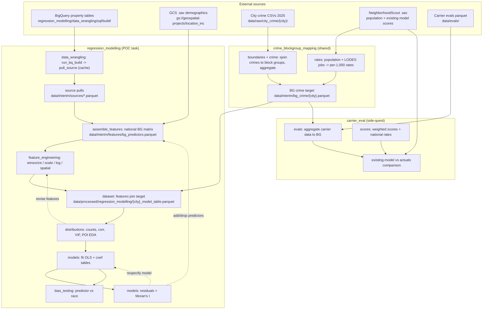

# Architecture — crime-idx-2026

This repo supports the statistical tasks needed to build (and evaluate) a
block-group crime-risk model. It is organized as **one module per task**, sharing a
single foundation module. Chicago and Houston (2025) are the initial POC samples;
four more cities follow.

See `docs/CONTEXT.md` for the glossary and `docs/adr/0001-task-oriented-module-restructure.md`
for the rationale behind this structure.

> **Status:** Some paths are built, others planned. Planned paths are marked
> _(planned)_ so a reader can tell the target design from what currently exists.

## Module map

```
src/
  crime_blockgroup_mapping/        # SHARED foundation (imported by both tasks)
    config.py        # paths only
    constants.py     # CityConfig + CITIES, crime-code maps, CRIME_CATEGORIES, BQ/GCS ids
    boundaries.py    # city boundary + state block groups + within-city labelling
    crime.py         # load crime, sjoin to BGs, map categories, aggregate to BG counts
    rates.py         # population source, LODES jobs, per-1,000 rate normalization
    plots.py         # general reusable map/plot helpers
  regression_modelling/            # TASK: POC crime-risk model rebuild
    config.py · constants.py       # PREDICTOR_COLS, TARGET_CATEGORIES, FEATURE_SOURCES
    data_wrangling/                # BQ/GCS ingestion, feature assembly, feature-⋈-target join
      sources.py · features.py · dataset.py · sql/{build,pull,explore}/
    feature_engineering/           # winsorize, scale, log, spatial terms
    distributions/                 # counts, distributions, corr, VIF; POI store-EDA (eda.py + plots.py)
    models/                        # OLS, coefficient tables, Moran's I diagnostic
    bias_testing/                  # predictor-vs-protected-attribute (e.g. race) checks
    logging/                       # run / experiment logging
  carrier_eval/                    # SIDE-QUEST: evaluate the existing model vs carrier data
    config.py · constants.py
    evals.py         # load/aggregate carrier evals + merge to BG crime
    scores.py        # compute_weighted_scores, extract_national_rates
notebooks/           # mirrors the module tree, outside src/
data/                # raw -> interim -> processed; catalogued in data/README.md
```

## Design principles

- **One folder per statistical task.** Each module has a single goal; no ambiguous
  names (`core`, `prediction`, `utils`).
- **One shared foundation.** `crime_blockgroup_mapping` is the only module both tasks
  import from — a single clean seam, no task-to-task dependency.
- **`config.py` = paths only; `constants.py` per module.** Constants, dataclasses,
  and registries never live in a global dumping ground.
- **Split ingestion from modeling.** Slow BigQuery/GCS pulls cache to Parquet under
  `data/interim`; modeling reloads locally (`refresh=False` unless a cache is stale).
- **Registry-driven sources.** Predictors declared as data in `FEATURE_SOURCES`
  (`regression_modelling/constants.py`), fetched by one generic `pull_source`.
- **One join key.** Everything normalizes to a 12-char `geoid` before merging.
- **Lifecycle-tiered data.** `data/raw` -> `data/interim` -> `data/processed`.

## Data flow



## Stage detail

### crime_blockgroup_mapping (shared)
- **boundaries** — load the city polygon (Census places) and state block groups,
  label block groups within the city by centroid.
- **crime** — load raw incident CSVs, spatial-join to block groups, map city-specific
  crime codes to the 7 primary categories, aggregate to BG-level counts (composites
  exclude vandalism).
- **rates** — obtain `population`, add LODES jobs (`c000`), normalize counts to
  per-1,000 rates (incl. daytime-adjusted); zero-population BGs -> NaN, never inf.
- **plots** — reusable map/plot helpers used by both tasks.
- Output: `data/interim/bg_crime/{city}.parquet`, consumed by both tasks.

### regression_modelling (POC task)
- **data_wrangling** — owns all task SQL under `sql/{build,pull,explore}` (one `SQL_DIR`).
  `run_bq_build(name)` materializes a BQ feature table from
  `sql/build/{name}.sql`; `pull_source(src)` reads it via `sql/pull/{name}.sql`,
  dispatches on backend, and caches to `data/interim/sources/{name}.parquet`.
  `assemble_features()` joins the demographic spine to every registry source on
  `geoid`; `dataset.build_model_table(city)` joins features to the target,
  filters to inside-city BGs, imputes, and log-transforms.
- **feature_engineering** — winsorizing, scaling, log transforms, and spatial terms
  on raw predictors.
- **distributions** — counts, distributions, correlations, VIF; POI store-EDA
  (`eda.py`) with folium visualization (`plots.py`). Its explore SQL templates live
  under `data_wrangling/sql/explore` (co-located with the `sources.load_sql` loader).
- **models** — fit OLS / regularized / spatial regression, coefficient tables, and
  diagnostics (HC3 SEs, residuals, **Moran's I**).
- **bias_testing** — verify predictors correlate with crime and not with protected
  attributes such as race.
- **logging** — record run configuration and results across iterations.

### carrier_eval (side-quest)
- **evals** — load carrier evals parquet, aggregate claims/losses/exposure to BG,
  merge with the shared BG crime target.
- **scores** — `compute_weighted_scores` (equal-representation relative-risk average)
  and `extract_national_rates` (`*_pt_u`); compare the existing model against actuals.

## Feedback loops

The pipeline is iterative, not linear:
- **distributions -> feature_engineering:** distribution/correlation/VIF findings
  drive adding, dropping, or transforming predictors.
- **models -> features / spec:** residual and coefficient patterns drive respecifying
  the model or the predictor set.
- **models -> bias_testing:** fitted predictors are checked against protected
  attributes before a spec is finalized.

## Configuration (cross-cutting)

Configuration feeds nearly every stage, so it is not a pipeline node:
- Each module has a `config.py` (paths only) and a `constants.py` (constants,
  dataclasses, registries).
- `crime_blockgroup_mapping/constants.py` — `CityConfig`/`CITIES`, crime-code maps,
  `CRIME_CATEGORIES`, BQ/GCS project ids (shared vocabulary).
- `regression_modelling/constants.py` — `PREDICTOR_COLS`, `TARGET_CATEGORIES`, the
  `FeatureSource` dataclass, and the `FEATURE_SOURCES` registry.
