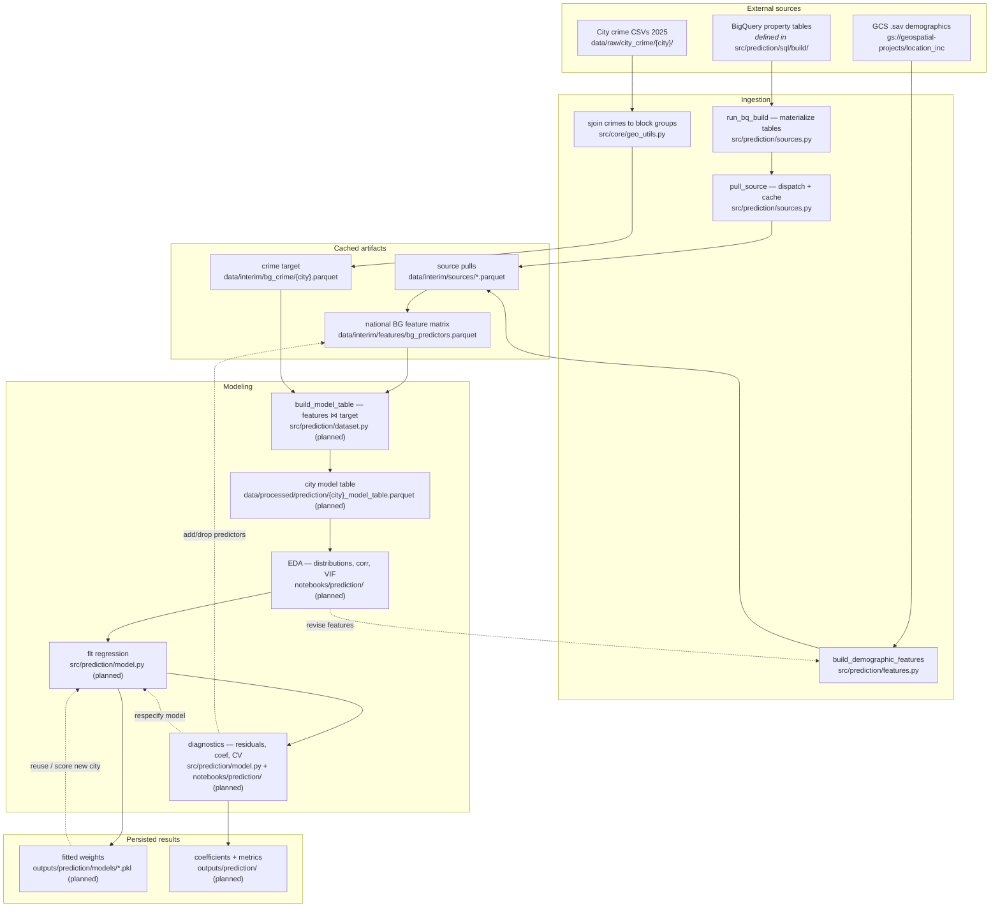

# Architecture — Crime Prediction Pipeline

This document describes the data flow for the block-group crime **prediction**
experiment: sourcing predictor features, joining them to city crime targets, and
fitting regression models. Chicago and Houston (2025) are the initial samples.

> **Status:** Some components are built, others are planned. Planned paths are
> marked _(planned)_ below so a reader can tell the target design from what
> currently exists.

## Design principles

- **Split ingestion from modeling.** Slow, networked pulls (BigQuery, GCS) are
  cached to Parquet so iterative modeling reloads locally instead of re-querying.
- **Registry-driven sources.** Atomic sources are declared as data in
  `FEATURE_SOURCES` (`src/prediction/config.py`) and fetched by one generic
  `pull_source`. Adding a source = one registry entry + one `.sql` file.
- **Layered responsibilities.** `load_sql` (text) → `run_bq_pull` (DataFrame) →
  `pull_source` (cache + dispatch). Each layer is independently usable/testable.
- **One join key.** Everything is normalized to a 12-char `geoid` block-group key
  before merging (GCS demographics arrive as `bg_key` and are renamed).
- **Lifecycle-tiered data.** `data/raw` (immutable sources) → `data/interim`
  (shared derived) → `data/processed` (experiment-specific model tables).

## Data flow

## Stage detail

### 1. External sources
- **BigQuery** — property-derived signals (e.g. `bg_vacancy`, `bg_clip_liens`)
  built by `CREATE OR REPLACE TABLE` DDL in `src/prediction/sql/build/`. The heavy
  aggregation runs once in BQ and persists as a staging table.
- **GCS `.sav`** — national demographic layers (ACS, census division, distance to
  city center, population rings) under
  `gs://geospatial-projects/location_inc/demographic/`.
- **City crime CSVs** — raw incident data for Chicago and Houston in
  `data/raw/city_crime/{city}/`.

### 2. Ingestion
- `run_bq_build(name)` materializes a BQ feature table from `sql/build/{name}.sql`.
  Runs rarely (only when upstream source data refreshes).
- `pull_source(src)` reads the small result via `sql/pull/{name}.sql`, dispatching
  on `src.backend` (`bq` or `gcs`), and caches to `data/interim/sources/{name}.parquet`.
- `build_demographic_features()` assembles the multi-step GCS demographic bundle
  (ACS + division + distance + population rings), normalizes `bg_key` → `geoid`,
  and caches to `data/interim/sources/demographic.parquet`.
- The **core geo pipeline** (`src/core/geo_utils.py`) spatially joins raw crime
  incidents to block groups and aggregates counts, producing the target.

**Re-runs:** ingestion only executes when a cache is missing or `refresh=True`.

### 3. Cached artifacts (`data/interim`)
- `sources/*.parquet` — per-source pulls (the materialized "data registry").
- `features/bg_predictors.parquet` — the national BG feature matrix produced by
  `assemble_features()`, joining the demographic spine to every registry source
  on `geoid`.
- `bg_crime/{city}.parquet` — the BG-level crime target, computed once and reused
  by both analysis and prediction.

### 4. Modeling
- `build_model_table(city)` _(planned, `src/prediction/dataset.py`)_ joins
  `bg_predictors` to the city target on `geoid`, filters to inside-city block
  groups, and writes `data/processed/prediction/{city}_model_table.parquet`.
- **EDA** _(planned, `notebooks/prediction/`)_ — distributions, correlations,
  multicollinearity (VIF) before fitting.
- **Fit** _(planned, `src/prediction/model.py`)_ — OLS / regularized / spatial
  regression of crime on the predictor set.
- **Diagnostics** _(planned)_ — residual analysis, coefficient inspection, and
  cross-validated metrics.

### 5. Persisted results (`outputs/prediction`) _(planned)_
- `models/*.pkl` — fitted weights, so a model can score a new city without refit.
- Coefficient and metric tables for tracking model iterations.

## Feedback loops

The pipeline is iterative, not linear:

- **EDA → features:** distribution/correlation findings drive adding, dropping, or
  transforming predictors (loops back to feature assembly).
- **Diagnostics → model spec:** residual and coefficient patterns drive respecifying
  the model (loops back to fitting).
- **Weights → new samples:** stored weights let you score an additional city or
  time period without retraining.

## Configuration (cross-cutting)

Configuration is not shown as a pipeline node because it feeds nearly every stage:

- `src/core/config.py` — shared paths, data tiers, project IDs, `CITIES`.
- `src/prediction/config.py` — prediction-only `SQL_DIR`, the `FeatureSource`
  dataclass, and the `FEATURE_SOURCES` registry.
